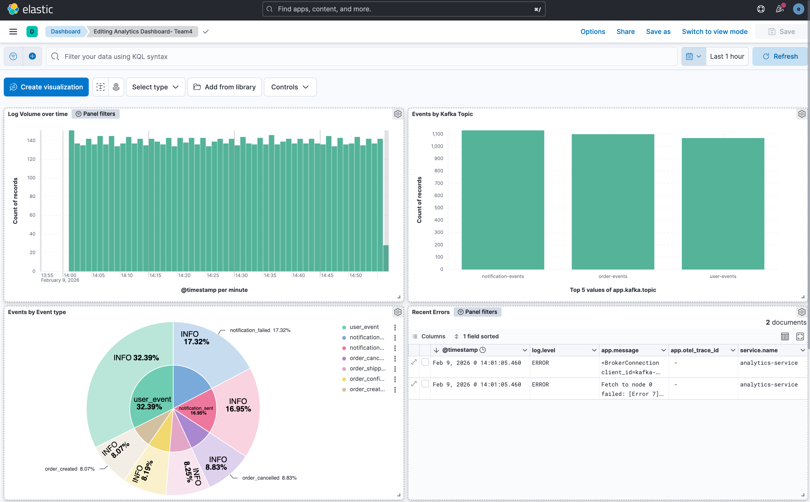
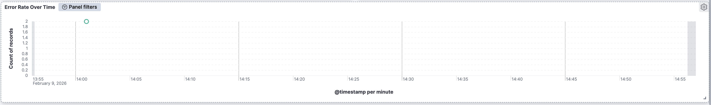
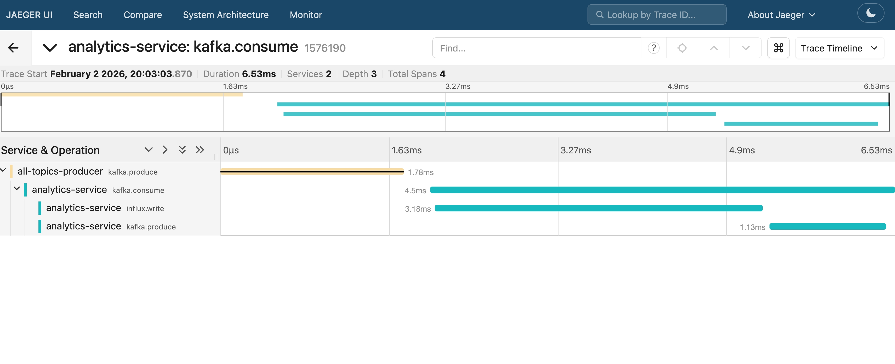

# Milestone 4: Logs, Tracing & Load Testing

## Objective

Enable deep, production-grade observability using:
- Structured JSON logs
- Centralized log aggregation (Elasticsearch + Kibana)
- Distributed tracing (OpenTelemetry + Jaeger)
- Load testing with observable impact on metrics

This milestone ensures the system is **debuggable under load**.

---

## 1. Structured JSON Logging

### Logging Strategy

All logs emitted by the Analytics Service follow **structured JSON format** and are written to `stdout` (12-factor compliant).

Each log entry contains:
- Timestamp (UTC)
- Log level
- Service name
- Message
- Trace identifiers
- Domain-specific metadata

### Log Schema

```json
{
  "timestamp": "2026-01-20T12:45:33.123Z",
  "level": "INFO",
  "service": "analytics-service",
  "message": "event processed",
  "trace_id": "6f3a9c9e2d8e4b1f",
  "otel_trace_id": "4bf92f3577b34da6a3ce929d0e0e4736",
  "otel_span_id": "00f067aa0ba902b7",
  "kafka": {
    "topic": "order-events",
    "partition": 0,
    "offset": 2341
  },
  "event": {
    "name": "order_shipped",
    "producer": "order-service"
  },
  "event_metrics": {
    "latency_ms": 127
  }
}
```

## Why Structured Logging?
- Enables precise filtering in Kibana
- Correlates logs with traces via trace_id
- Supports automated parsing by Filebeat

### Centralized Log Pipeline
```Flow

Analytics Service (stdout)
        ↓
Kubernetes container logs
        ↓
Filebeat (DaemonSet)
        ↓
Elasticsearch (central store)
        ↓
Kibana (analysis & dashboards)
```

### Filebeat Responsibilities
- Collect logs from /var/log/containers
- Enrich logs with Kubernetes metadata
- Decode JSON payloads
- Normalize fields to ECS-compatible format
- Route logs to Elasticsearch index: `logs-team4-v1-*`

### Kibana Saved Searches
The following saved searches are pre-created automatically:

1. <u> All ERROR Logs (Last 1 Hour)</u>

    Purpose: Detect failures quickly

    Query:
```
service.name :"analytics-service" AND log. level:"ERROR" AND @timestamp >= now-1h
```
2. <u>Slow Requests / Slow Event Processing</u>

    Purpose: Identify performance bottlenecks

    Query:

```
latency_ms > 500
```

3. <u> Logs for a Given Trace ID </u>

    Purpose: End-to-end debugging across services
    
    Query:

```
app.otel.trace_id:"<TRACE_ID>"
```

### Kibana Dashboards



## Distributed Tracing

Tracing Architecture

```
Producer Service
   ↓ (Kafka headers)
Analytics Service
   ↓
OpenTelemetry Collector
   ↓
Jaeger
```


Here, higher the point , the more time that trace consumes.

## Tracing Coverage

Spans are created for:
- Kafka production (other services)
- Kafka consumption (kafka.consume)
- InfluxDB writes
- Kafka production (analytics events)



### Benefits
- Visualizes cross-service flows
- Identifies latency contributors
- Enables root cause analysis

## Load Testing (50 req/s)
Test Configuration
- Tool: k6


```Js
export const options = {
  vus: 50,
  duration: '1m',
};
```
Target:

```GET /health```


Observations During Load
- Metrics
    - Request rate stabilized at ~100 req/s
    - p95 latency remained < 200 ms
    - No increase in error rate
    - Resource Usage
    - CPU usage increased predictably
    - No memory leaks observed

- Logs
    - No ERROR logs generated
    - INFO logs remained structured

### ` Kafka Producer Replicas = 2`
- To simulate real-world parallel ingestion:
Producer deployments were scaled to 2 replicas
- Analytics consumer handled increased throughput correctly
- No message loss observed

---
## Conclusion
Milestone 4 validates that the Analytics Service is:
- Fully observable
- Debuggable under load
- Traceable across services
- Log-safe and schema-consistent